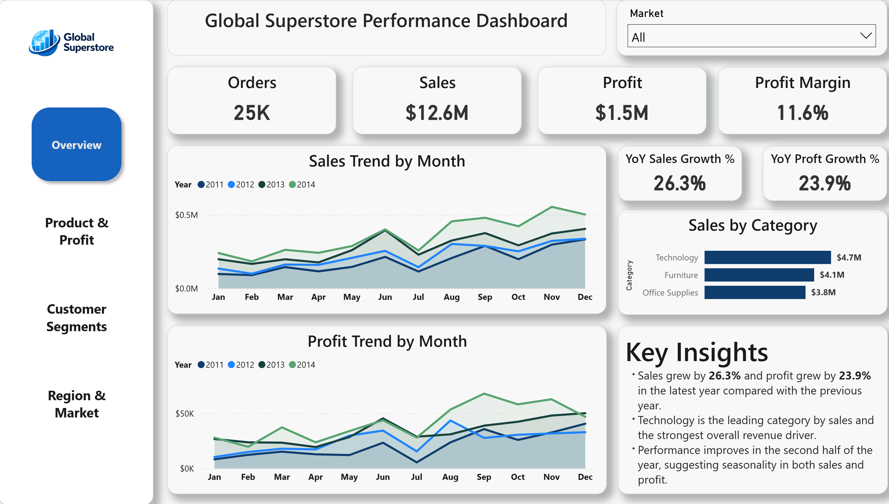
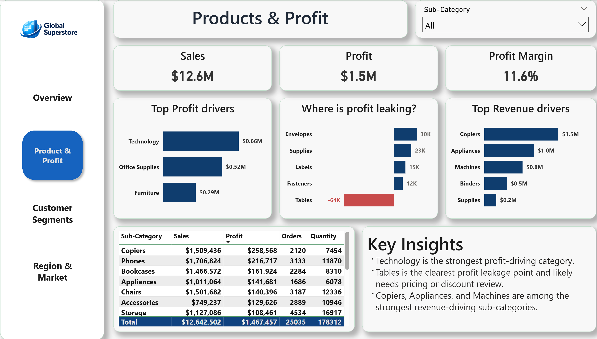
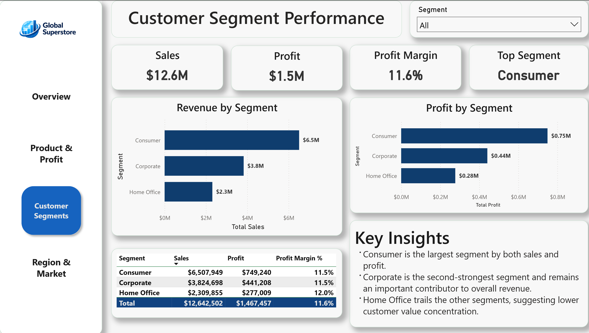
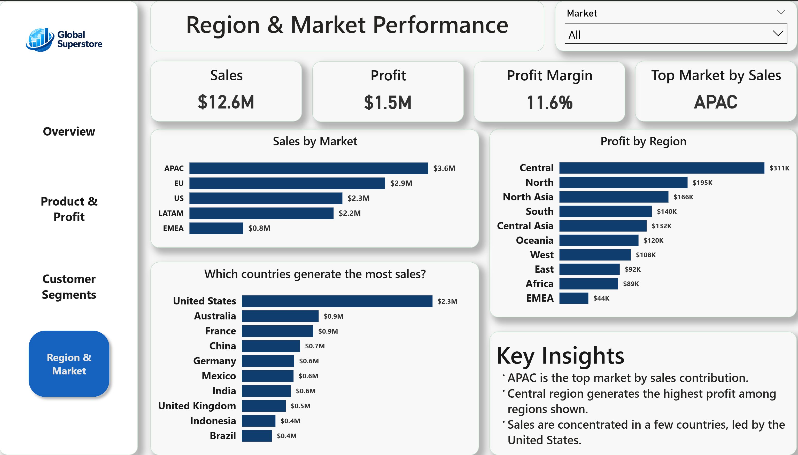

# Global Superstore Performance Dashboard — Power BI

> **A four-page Power BI dashboard analyzing $12.6M in global retail sales across 147 countries to surface profitability drivers, segment performance, and regional trends.**

---

## Skills Demonstrated

- **Power Query ETL** — data inspection, type validation, and preparation
- **DAX Measures** — KPIs, YoY growth calculations, ranking logic, profit margin analysis
- **Data Modeling** — dedicated date table, star-schema relationships
- **Business Storytelling** — four-page narrative from overview → products → segments → geography
- **Interactive Reporting** — slicers, drill-through, bookmarks, and conditional formatting

---

## Key Findings

| Insight | Detail |
|---|---|
| 📈 **Strong YoY Growth** | Sales up **26.3%**, profit up **23.9%** in the latest year |
| 💻 **Technology Leads** | Top category by both revenue and profit contribution |
| 🚨 **Tables Bleeding Profit** | **−$64K** in losses despite meaningful sales — pricing/discount issue |
| 🌏 **APAC Dominates Sales** | Largest market by revenue; US leads at the country level |

---

## Tools Used

| Tool | Purpose |
|---|---|
| Power BI Desktop | Dashboard design, interactive reporting |
| Power Query | Data cleaning & transformation |
| DAX | KPIs, growth measures, ranking logic |
| Python (pandas) | Data validation & quality checks |

---

## Dashboard Pages

### 1 — Overview
High-level snapshot of business health — $12.6M in sales, $1.5M in profit, and 11.6% margin. Tracks monthly trends and category contribution, showing Technology as the dominant revenue driver and performance strengthening in the second half of each year.

### 2 — Products & Profit
Breaks down profitability by category and sub-category to reveal where the business makes and loses money. Tables stands out as the clearest problem area at −$64K in losses, while Copiers and Phones lead profit contribution.

### 3 — Customer Segments
Compares Consumer, Corporate, and Home Office across sales, profit, and margin. Consumer drives the most volume, but Home Office delivers the highest profit margin — a signal worth exploring for targeted growth.

### 4 — Region & Market
Maps performance across five global markets, multiple regions, and 147 countries. APAC leads total sales, while revenue at the country level is concentrated in a small group led by the United States.

---

## How to Use

1. Download [`Global_Superstore2.csv`](https://www.kaggle.com/datasets/apoorvaappz/global-super-store-dataset/data) and the `.pbix` file from this repo.
2. Open the `.pbix` in Power BI Desktop — all measures and visuals are pre-built.
3. Use slicers and drill-through to explore by category, segment, market, or time period.

---

*Built by **Chuka Walter Obi** — M.Sc. Big Data Analytics, Trent University · M.Sc. Applied Mathematics, California State University Long Beach · [LinkedIn](https://www.linkedin.com/in/chuka-obi-2022b7140/)*
